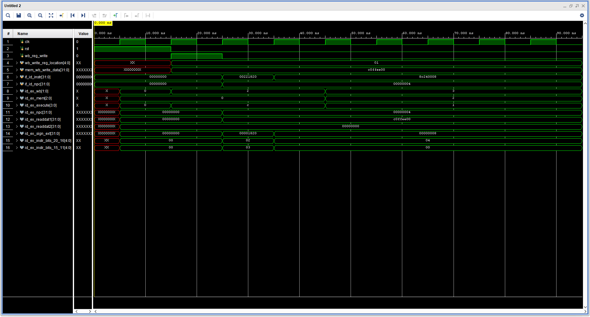

# MIPS Pipeline: Instruction Decode (ID) Stage

## Project Overview
This repository contains the Verilog implementation of the **Instruction Decode (ID) Stage** for a 32-bit MIPS pipeline processor. The primary objective of this stage is to translate raw 32-bit instructions into functional control signals and operand data required for the subsequent Execution (EX) stage

## Key Components Implemented
* **Control Unit (`control.v`)**: Decodes the 6-bit opcode to generate `WB`, `MEM`, and `EX` control signals for R-format, LW, SW, and BEQ instructions
* **Register File (`regfile.v`)**: A 32x32-bit register array capable of simultaneous dual-read and single-write operations
* **Sign Extender (`signExt.v`)**: Converts 16-bit immediate values into 32-bit values while preserving the sign bit
* **ID/EX Latch (`idExLatch.v`)**: A pipeline register that synchronizes and passes all decoded data and control signals to the next stage

## Verification Methodology
The functionality was verified using a custom testbench (`decode_tb.v`) targeting the following scenarios

### 1. Register Data Integrity (The "Coffee" Test)
To verify that the **Register File** correctly stores and retrieves data, Register 1 was initialized with the hexadecimal constant `32'hC0FFEE00`. Subsequent instructions successfully read this value, confirming that the internal memory array is stable and the read-enable logic is functional.

### 2. R-Format Decoding
An `ADD` instruction (`32'h00221820`) was processed to verify
* Correct extraction of `rs`, `rt`, and `rd` addresses.
* Activation of the `ALUOp` and `RegDst` signals in the `EX` control bus.

### 3. I-Format Decoding (Load Word)
An `LW` instruction (`32'h8C240008`) was processed to verify:
* **Sign Extension**: Converting the immediate value `0008` to `00000008`.
* **Memory Control**: Enabling `MemRead` and setting `RegWrite` to prepare for the Write Back phase.

## Simulation Results
The timing diagram (`timing_diagram_DECODE.png`) illustrates that all control signals and register outputs transition exactly one clock cycle after the instruction arrives at the `if_id_instr` input, as dictated by the synchronous nature of the pipeline latch.

